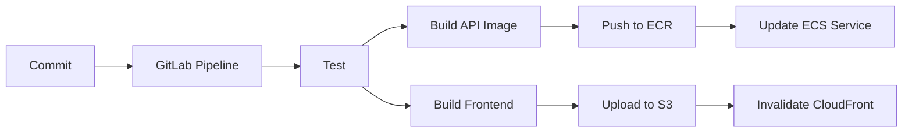

# From-Scratch Guide: Turbo Monorepo to AWS Deploy

This guide walks you from zero to a minimal Turbo monorepo (one frontend, one API, one shared package) through local run and AWS deploy. You run the commands and edit the files; the guide only describes what to do and why.

**How to use:** Keep this file in the project root (or in `docs/`) so an AI in another Cursor window can read it for context. Minimal = one app per type (one frontend, one API, one shared package), one route, one component.

---

## 0. How to Use This Guide

- **You** run commands and create/edit files; the guide only instructs.
- Keep this file in the project root or `docs/` in the new window so the AI in that chat can read it.
- **Minimal** = one app per type (one frontend, one API, one shared package), one route, one component.

---

## 1. Prerequisites (Tools Only)

Install and enable these before creating any project files. No repo files are created in this step.

| Command / action | What it does |
|------------------|--------------|
| `volta install node` | Pins and manages Node version for the project (avoids "works on my machine"). |
| `corepack enable` | Enables Corepack (Node’s tool for package managers). |
| `corepack enable pnpm` | Enables pnpm without a separate global install; pnpm is used for the monorepo. |
| Git config | Set `user.name` and `user.email` if not already done. |
| Docker (optional) | For local Postgres later; not required for the minimal path. |

**What gets created:** Nothing in the project yet; you are only preparing the machine.

---

## 2. Create the Monorepo Root (Turbo + pnpm)

### Option A – Using create-turbo

**Option A1 – New folder (creates `my-minimal-app/` as a child):**
```bash
npx create-turbo@latest my-minimal-app
```
Run this from the parent directory; you get `my-minimal-app/` with all files inside it.

**Option A2 – Current directory (no extra nested folder):**
```bash
mkdir my-minimal-app && cd my-minimal-app
npx create-turbo@latest .
```
Run this when you want the project files directly in the folder you are in (e.g. `my-minimal-app`). No `my-minimal-app/my-minimal-app` nesting.

**What gets created:**
- Root: `package.json`, `pnpm-workspace.yaml`, `turbo.json`
- `apps/` and `packages/` with example apps (e.g. `web`, `docs`, `ui`, `eslint-config`)

**What to change or remove:**
- **Root `package.json`:** Simplify scripts to only what you need: `build`, `dev:user`, `lint`, `test`, `tsc`. Remove scripts you won’t use.
- **apps/ and packages/:** Remove or replace the example apps so you can add your own minimal apps (frontend-app, api-app). You can delete the generated folders and create new ones.
- **turbo.json:** Keep or simplify. Ensure:
  - `build` has `dependsOn: ["^build"]` (build dependencies first).
  - `dev:user` is a persistent task (no cache).
  - Other tasks (lint, test, tsc) as needed; cache is optional for minimal.

**Why each root file:**

| File | Purpose |
|------|--------|
| `package.json` | Orchestrates scripts via Turbo; may include `packageManager` and optional `volta` pin for Node. |
| `pnpm-workspace.yaml` | Defines workspace packages (e.g. `apps/*`, `packages/*`) so pnpm links them. |
| `turbo.json` | Task graph (which tasks depend on which) and cache rules for build/lint/test. |

### Option B – Manual (no create-turbo)

1. Create project folder and `cd` into it.
2. Create root `package.json` with name, private, scripts (build, dev:user, lint, test, tsc), and optional `packageManager` / `volta`.
3. Create `pnpm-workspace.yaml` with `packages: ["apps/*", "packages/*"]`.
4. Create `turbo.json` with tasks (build, dev:user, lint, test, tsc) and `dependsOn` for build.
5. Run `mkdir apps packages`.

Same “why” for each file as in the table above.

---

## 3. Frontend App (Vite + React)

**Command (from repo root or from `apps/`):**
```bash
pnpm create vite@latest frontend-app -- --template react-ts
```
Use `react` if you prefer JavaScript instead of TypeScript.

**What gets created:**
- `apps/frontend-app/`: `package.json`, `index.html`, `src/main.tsx`, `src/App.tsx`, `vite.config.ts`, `tsconfig.json`, `tsconfig.node.json`, often `src/index.css`, `public/`, etc.

**What to change or remove:**
- **App.tsx:** Simplify to a single component (or inline in `main.tsx`). Remove demo boilerplate.
- **CSS:** Remove or simplify unused styles; keep only what you need.
- **Scripts in package.json:** Add/keep scripts Turbo expects: `dev:user` (e.g. `vite`), `build`, `lint`, `test` (can be placeholder like `echo "no tests"`).
- **vite.config.ts:** Simplify: e.g. React plugin; optionally `server.port` (e.g. 5173). Port 5173 is Vite’s default if you don’t set it.
- Keep `index.html` and `main.tsx` as entry points.

**Why each file:**

| File | Purpose |
|------|--------|
| `index.html` | Browser entry; loads the script that boots the app (e.g. `main.tsx`). |
| `src/main.tsx` | React mount point; renders the root component into the DOM. |
| `vite.config.ts` | Vite build and dev config: plugins, port, base path if needed. |
| `tsconfig.json` | Usually just references; points to app and node configs (see below). |
| `tsconfig.app.json` | TypeScript rules for app code in `src/` (browser, React, DOM). |
| `tsconfig.node.json` | TypeScript rules for `vite.config.ts` only (Node, not browser). Split from app so one config doesn’t mix browser and Node rules. |

---

## 4. API App (Express + esbuild) – No Generator, Manual

There is no standard generator for a minimal TypeScript Express API in a monorepo. The official `express-generator` creates a different layout (JavaScript, views, routes folders). Create the API app manually (or with AI help in another window).

**Command:** None. Create the files below by hand.

**Files to create (minimal):**

1. **`apps/api-app/package.json`**
   Scripts: `build`, `dev:user`, `lint`, `test`, `tsc`. Dependencies: `express`; devDependencies: `esbuild`, `tsx`, `typescript`, `@types/node`, `@types/express`.

```json
{
  "name": "api-app",
  "private": true,
  "scripts": {
    "build": "tsx scripts/build.ts",
    "dev:user": "tsx watch src/index.ts",
    "lint": "echo \"lint\"",
    "test": "echo \"no tests\"",
    "tsc": "tsc --noEmit"
  },
  "dependencies": { "express": "^4.18.0" },
  "devDependencies": {
    "esbuild": "^0.19.0",
    "tsx": "^4.0.0",
    "typescript": "^5.0.0",
    "@types/node": "^20.0.0",
    "@types/express": "^4.17.0"
  }
}
```

2. **`apps/api-app/src/index.ts`**
   Express app with `/health` and a route that returns real data (in-memory list). Listen on `process.env.PORT` or 4000.

```ts
import express from "express";

const app = express();
app.use(express.json());

const port = Number(process.env.PORT) || 4000;

// In-memory data so you can see real JSON when you call the API
const items = [
  { id: "1", name: "Item One", quantity: 10 },
  { id: "2", name: "Item Two", quantity: 5 },
  { id: "3", name: "Item Three", quantity: 12 },
];

app.get("/health", (_req, res) => {
  res.json({ ok: true });
});

// GET all items – returns real data you can see in browser or curl
app.get("/api/items", (_req, res) => {
  res.json(items);
});

// GET one item by id – e.g. GET /api/items/1
app.get("/api/items/:id", (req, res) => {
  const item = items.find((i) => i.id === req.params.id);
  if (!item) return res.status(404).json({ error: "Not found" });
  res.json(item);
});

app.listen(port, () => {
  console.log(`API listening on port ${port}`);
});
```

3. **`apps/api-app/scripts/build.ts`**
   Use esbuild: one entry point (`src/index.ts`), bundle, platform `node`, outfile `dist/index.js`. Run from `apps/api-app` (e.g. `pnpm build`). Uses `tsx` to run the script.

```ts
import * as esbuild from "esbuild";

await esbuild.build({
  entryPoints: ["src/index.ts"],
  bundle: true,
  platform: "node",
  outfile: "dist/index.js",
});
console.log("Build done: dist/index.js");
```

4. **`apps/api-app/tsconfig.json`**
   Target ES2020, module NodeNext, strict, include `src` and `scripts`.

```json
{
  "compilerOptions": {
    "target": "ES2020",
    "module": "NodeNext",
    "strict": true,
    "outDir": "dist",
    "rootDir": ".",
    "skipLibCheck": true
  },
  "include": ["src", "scripts"]
}
```

**What to change or remove:** N/A (you are creating from scratch).

**Why each file:**

| File | Purpose |
|------|--------|
| `package.json` | API dependencies and scripts; Turbo runs build/dev:user/lint/test from here. |
| `src/index.ts` | Server entry; defines routes and starts the HTTP server. |
| `scripts/build.ts` | Produces a single bundle for deployment; esbuild is fast and outputs one file. |
| `tsconfig.json` | TypeScript settings for the API (strict, module, target). |

**Why esbuild:** Fast, single output file, good for Node APIs. Using `tsc` alone does not bundle (only emits .js per .ts); esbuild bundles so you deploy one `dist/index.js`.

---

## 5. Shared Packages – Database and Tsconfig (Optional)

### Database package

**Command:** None. Create manually.

**Files to create:**
- `packages/database/package.json` – script: `migrate:deploy` (e.g. `prisma migrate deploy`). Dependencies: `@prisma/client`; devDependencies: `prisma`.
- `packages/database/prisma/schema.prisma` – generator `client`, datasource `db` (e.g. `env("DATABASE_URL")`), one model (e.g. `User` with `id`, `email`).

**What to change or remove:** N/A.

**Why:** Single place for schema and migrations; `migrate:deploy` is used in CI or before starting the API. In Prisma, **generator** controls the client output; **datasource** points at the database (URL).

### Tsconfig package (optional)

**Files to create:**
- `packages/tsconfig/package.json` (no scripts needed; just a package so it can be referenced).
- `packages/tsconfig/react.json` – base config for React apps (jsx, moduleResolution, strict, etc.).
- `packages/tsconfig/node.json` – base config for Node apps (target, module, strict).

**Why:** Share TypeScript options across apps so you see this pattern; minimal = two JSONs that apps extend via `extends: "@repo/tsconfig/react.json"` or `node.json`.

---

## 6. Git – Personal Profile: Create Project, Clone, Pull, Push

This section is for using Git with your **personal** account (GitHub or GitLab). You will create a remote repo, connect your local project, and use pull/push daily.

### 6.1 One-time: Git config (personal identity)

**Commands (run once per machine):**
```bash
git config --global user.name "Your Name"
git config --global user.email "your.email@example.com"
```

Use the same email as your GitHub/GitLab account so commits link to your profile.

### 6.2 Create the remote project (personal repo)

**Steps (no repo files yet):**

1. **GitHub:** Sign in → click **New repository**. Name (e.g. `my-minimal-app`), visibility **Private** or **Public**, do **not** add README/.gitignore (you already have a local project).
2. **GitLab:** New project → **Create blank project**. Project name, visibility, leave “Initialize with README” **unchecked**.

**What you get:** A remote URL, e.g.:
- GitHub: `https://github.com/YOUR_USERNAME/my-minimal-app.git` or `git@github.com:YOUR_USERNAME/my-minimal-app.git`
- GitLab: `https://gitlab.com/YOUR_USERNAME/my-minimal-app.git` or `git@gitlab.com:YOUR_USERNAME/my-minimal-app.git`

### 6.3 Connect local project to remote (first time)

**If you started the project locally (you already ran `git init`):**

```bash
# From repo root
# If you see "error: remote origin already exists", use set-url instead of add:
#   git remote set-url origin https://github.com/YOUR_USERNAME/my-minimal-app.git
git remote add origin https://github.com/YOUR_USERNAME/my-minimal-app.git
# Or SSH: git remote add origin git@github.com:YOUR_USERNAME/my-minimal-app.git
git branch -M main
git add .
git commit -m "Initial commit: Turbo monorepo with frontend and API"
git push -u origin main
```

**If you prefer to start from the remote (clone empty repo then add code):**

```bash
git clone https://github.com/YOUR_USERNAME/my-minimal-app.git
cd my-minimal-app
# Then create or copy in your app files (sections 2–5), then:
git add .
git commit -m "Initial commit: Turbo monorepo with frontend and API"
git push -u origin main
```

### 6.4 Daily workflow: pull and push

**Get latest from remote (before you start work or when others push):**
```bash
git pull origin main
```

**Save your work and send to remote:**
```bash
git add .
git status   # optional: see what will be committed
git commit -m "Your short message"
git push origin main
```

**Create a branch (e.g. for a feature), then push it:**
```bash
git checkout -b feature/my-feature
# ... edit files ...
git add .
git commit -m "Add my feature"
git push -u origin feature/my-feature
```

Then open a Pull Request (GitHub) or Merge Request (GitLab) from that branch into `main`.

### 6.5 Summary: Git commands (personal profile)

| Goal | Command |
|------|--------|
| First-time config | `git config --global user.name "..."` and `user.email "..."` |
| Create remote repo | GitHub/GitLab: New repository, no README |
| Connect local to remote | `git remote add origin <URL>` (or `git remote set-url origin <URL>` if origin already exists) then `git push -u origin main` |
| Get latest | `git pull origin main` |
| Save and send | `git add .` → `git commit -m "..."` → `git push origin main` |
| New branch | `git checkout -b branch-name` then `git push -u origin branch-name` |

---

## 6b. Git – Hooks and .gitignore

**Commands:**
```bash
git init
```

**What to create:**
- **`.gitignore`** – Include: `node_modules`, `dist`, `.env`, `.pnpm-store`, `.turbo`, `*.log`, OS files (e.g. `.DS_Store`). If create-turbo added one, merge or replace with this minimal set.
- **Git hooks:** Create `git-hooks/pre-commit` and `git-hooks/commit-msg` (simplified: e.g. `#!/bin/sh` and `exit 0`). Then:
  ```bash
  chmod +x git-hooks/pre-commit git-hooks/commit-msg
  ln -s ../../git-hooks/pre-commit .git/hooks/pre-commit
  ln -s ../../git-hooks/commit-msg .git/hooks/commit-msg
  ```
  (Paths may vary; adjust so the symlinks point to the real scripts.)

**What to change or remove:** If create-turbo added `.gitignore`, ensure it has the entries above; add short comments if you want (why `node_modules`, `dist`, `.env`).

**Why:**
- **.gitignore:** Avoid committing build output (`dist`), dependencies (`node_modules`), secrets (`.env`), and cache (`.turbo`, `.pnpm-store`).
- **Hooks:** Enforce branch name or commit message format (e.g. conventional commits); the simplified scripts are placeholders you can replace with real checks later.

---

## 7. Install and Run Locally

**Commands (from repo root):**
```bash
pnpm install
cd apps/api-app && pnpm build
```
Then run the API (from `apps/api-app`):
```bash
PORT=4000 node --watch ./dist/index.js
```
In another terminal, run the frontend (from repo root):
```bash
cd apps/frontend-app && pnpm dev:user
```

**What gets created:** `node_modules/`, `pnpm-lock.yaml`, `apps/api-app/dist/index.js`.

**What to change or remove:** Nothing; this step is to verify the flow.

**Why:** Confirms full local flow (install → build API → run API and frontend) before setting up CI/deploy.

---

## 8. Docker (API Image for ECS)

**Command:** None. Create files manually.

**Files to create:**

1. **`apps/api-app/Dockerfile`**
   Multi-stage:
   - **Base:** Node image, set workdir, copy root `package.json` and `pnpm-lock.yaml`, run `corepack enable pnpm` and `pnpm install --frozen-lockfile` (or use `turbo prune` to get a pruned monorepo and then install).
   - **Prune/build:** Use `turbo prune api-app` (or equivalent) to get only the api-app and its dependencies; install and run `pnpm build` for the API.
   - **Runner:** Slim image, copy only `node_modules` (production) and built `dist` (or equivalent), set entrypoint (e.g. `node dist/index.js` or `entrypoint.sh`).

2. **`apps/api-app/entrypoint.sh`**
   Set `DATABASE_URL` from env if needed, then `exec node dist/index.js` (or the actual entry). Make it executable (`chmod +x`).

**What to change or remove:** N/A.

**Why:** ECR/ECS need an image; multi-stage keeps the final image small; entrypoint lets you set env at runtime (e.g. from ECS task definition).

---

## 9. GitLab CI/CD

**Command:** None. Create manually.

**File to create:** `.gitlab-ci.yml`

**Suggested stages and jobs:**

| Stage | Job | What to do |
|-------|-----|------------|
| test | Run once | `pnpm install`, `pnpm tsc`, `pnpm lint`, `pnpm test` (from root with Turbo). |
| build-api | After test | Docker build for API app, then docker push to ECR (after assume-role). |
| build-frontend | After test | `pnpm build` in frontend app (or via Turbo), upload `dist` (or `apps/frontend-app/dist`) to S3. |
| deploy-api (optional) | After build-api | Update ECS service (new task definition or force new deployment). |
| deploy-frontend (optional) | After build-frontend | Invalidate CloudFront distribution for the frontend. |
| cache-clear (optional) | Manual or on release | Clear CloudFront cache if needed. |

**Required CI/CD variables (examples):**
- `DEVELOP_ASSUME_ROLE_ARN` (or similar) – for GitLab to assume an IAM role and push to ECR.
- `AWS_DEFAULT_REGION` – region for ECR, ECS, S3.
- `ECR_REGISTRY` / `ECR_REPOSITORY` – where to push the API image.
- `S3_BUCKET` – bucket for frontend assets.
- `CLOUDFRONT_DISTRIBUTION_ID` – for invalidation (optional until you add deploy-frontend).

**What to change or remove:** Start minimal (test + build-api + build-frontend); add deploy steps when AWS resources are ready.

**Why:** One YAML file shows the full CI shape: stages, rules, and what each job does (test, build image, build static site, deploy).

---

## 10. AWS – Step-by-Step from Account Creation to Final Deploy

Follow these in order. All steps are in the AWS Console unless noted.

### 10.1 Create AWS account

1. Go to [aws.amazon.com](https://aws.amazon.com) → **Create an AWS Account**.
2. Enter email, password, account name (e.g. “MyPersonal”).
3. Choose **Personal** or **Professional**, fill contact and payment (card required; free tier applies where eligible).
4. Verify identity (phone or card).
5. Choose **Free** support plan and finish.

**Result:** You have a root user. Do not use it for daily work; use an IAM user (next step).

### 10.2 Secure root user (one-time)

1. Sign in as root → **Account** (top right) → **Security credentials**.
2. Under **Multi-factor authentication (MFA)** → **Assign MFA device** → use an authenticator app (e.g. Google Authenticator), scan QR, enter two codes.
3. (Recommended) Create an **IAM user** for yourself and stop using root for console/CLI.

### 10.3 Create IAM user for yourself (daily use)

1. **IAM** → **Users** → **Create user**. Name (e.g. `my-user`), **Provide user access to the AWS Management Console** → **Custom password**, uncheck “Users must create a new password at next sign-in” if you want to reuse the same password.
2. **Next** → **Attach policies directly** → add `AdministratorAccess` (for learning; in production use least-privilege policies).
3. **Next** → **Create user**.
4. Save **Console sign-in URL** (e.g. `https://123456789012.signin.aws.amazon.com/console`) and the password. Sign in with this user from now on.

### 10.4 Create IAM role for CI (GitLab to assume)

1. **IAM** → **Roles** → **Create role**.
2. **Trusted entity type:** Custom trust policy. **Next**.
3. **Trust policy:** Use a policy that allows your GitLab project (OIDC or access key). Example for **OIDC (GitLab.com)**:
   - In GitLab: **Settings → CI/CD → Variables**; you will add `CI_JOB_JWT` or use GitLab’s OIDC provider.
   - In AWS: Trust policy allows `gitlab.com` to assume this role (see AWS/GitLab docs for exact `Principal` and `Condition`). For **simplest start**, you can create an IAM user for CI with access keys and put keys in GitLab variables (less secure; use OIDC when possible).
4. **Next** → **Add permissions:** Create or attach a policy that allows: `ecr:*`, `ecs:*`, `s3:PutObject`, `s3:GetObject`, `s3:ListBucket`, `cloudfront:CreateInvalidation`. Attach to the role.
5. Name the role (e.g. `gitlab-ci-deploy`) → **Create role**.
6. Copy the **Role ARN** (e.g. `arn:aws:iam::123456789012:role/gitlab-ci-deploy`). You will put this in GitLab CI/CD variables as `DEVELOP_ASSUME_ROLE_ARN` or similar.

### 10.5 Create ECR repository (API image)

1. **ECR** → **Repositories** → **Create repository**.
2. Name: `api-app`. Visibility: Private. **Create repository**.
3. Note the **URI** (e.g. `123456789012.dkr.ecr.us-east-1.amazonaws.com/api-app`). You need: **Registry** (e.g. `123456789012.dkr.ecr.us-east-1.amazonaws.com`) and **Repository** (`api-app`) for GitLab variables.

### 10.6 Create ECS cluster, task definition, and service

**Cluster:**

1. **ECS** → **Clusters** → **Create cluster**. Name: `my-cluster`. **Create**.

**Task definition:**

2. **Task definitions** → **Create new task definition** → **JSON** (or form).
3. Family: `api-app`. Container: name `api`, image = your ECR URI (e.g. `123456789012.dkr.ecr.us-east-1.amazonaws.com/api-app:latest`). Port mappings: container port `4000`, host port `4000`. Environment: `PORT=4000` (and `DATABASE_URL` if you add RDS later). CPU/memory: e.g. 256 CPU, 512 MiB. Execution role and task role: use the same CI role or a dedicated ECS task role that can pull from ECR.
4. **Create**.

**Service:**

5. **Clusters** → **my-cluster** → **Services** → **Create**.
6. Task definition: `api-app`. Service name: `api-service`. Desired tasks: 1. **Create service**.

**Result:** ECS will try to run the task; it will fail until the image exists in ECR (after first pipeline run). You can note the **public IP** of the task (if using Fargate with public subnet) or attach an Application Load Balancer (ALB) and use the ALB URL.

### 10.7 Create S3 bucket (frontend)

1. **S3** → **Create bucket**. Name (e.g. `my-minimal-app-frontend-123456789012`), region same as ECR/ECS.
2. **Block all public access** = On (we will serve via CloudFront only).
3. **Create bucket**.
4. (After CloudFront is created) **Bucket → Permissions** → **Bucket policy**: allow `GetObject` only from your CloudFront distribution’s OAI (Origin Access Identity) or OAC. This keeps the bucket private.

### 10.8 Create CloudFront distribution (frontend)

1. **CloudFront** → **Create distribution**.
2. **Origin:** Origin domain = your S3 bucket (e.g. `my-minimal-app-frontend-123456789012.s3.us-east-1.amazonaws.com`). Use **Origin access**: Origin access control (OAC); create new OAC. S3 bucket policy can be updated automatically when prompted.
3. **Default cache behavior:** Viewer protocol policy = Redirect HTTP to HTTPS. Allowed methods: GET, HEAD, OPTIONS.
4. **Settings:** Default root object = `index.html`. Error pages (optional): 403 and 404 → respond with `index.html` and 200 (for SPA routing).
5. **Create distribution**. Note the **Distribution domain name** (e.g. `d1234abcd.cloudfront.net`) and **Distribution ID**. Use the domain (or your custom domain) as the frontend URL.

### 10.9 Set GitLab CI/CD variables and run pipeline

1. In GitLab: **Project → Settings → CI/CD → Variables**. Add (masked where possible):
   - `AWS_ACCESS_KEY_ID`, `AWS_SECRET_ACCESS_KEY` (if using access keys for CI), **or** configure OIDC and use `DEVELOP_ASSUME_ROLE_ARN`.
   - `AWS_DEFAULT_REGION` (e.g. `us-east-1`).
   - `ECR_REGISTRY` (e.g. `123456789012.dkr.ecr.us-east-1.amazonaws.com`).
   - `ECR_REPOSITORY` = `api-app`.
   - `S3_BUCKET` = your bucket name.
   - `CLOUDFRONT_DISTRIBUTION_ID` = your distribution ID (for invalidation).

2. Push to `main` (or your CI branch). Pipeline runs: test → build API image → push to ECR → build frontend → upload to S3 → (optional) invalidate CloudFront, update ECS service.

### 10.10 Final deploy verification

1. **API:** Open the ECS task’s public IP and port (e.g. `http://<task-public-ip>:4000/health`) or the ALB URL. You should see `{"ok":true}` or similar.
2. **Frontend:** Open the CloudFront URL (e.g. `https://d1234abcd.cloudfront.net`). You should see your React app.

**One sentence per service:**
- **ECR** – Store Docker images that ECS runs.
- **ECS** – Run the API container.
- **S3** – Hold built frontend files (HTML, JS, CSS).
- **CloudFront** – Serve frontend with HTTPS and caching.

---

## 11. Deploy Flow End-to-End

### Diagram (simplified)



### Before first deploy (checklist)

- [ ] IAM role for CI created; assume-role ARN added to GitLab CI variables.
- [ ] ECR repository created for API image.
- [ ] ECS cluster, task definition, and service created; task uses image from ECR and has required env (e.g. `DATABASE_URL`, `PORT`).
- [ ] S3 bucket created; bucket policy allows CloudFront only (no public read).
- [ ] CloudFront distribution created with S3 as origin; default root object set.
- [ ] (Optional) RDS and security groups; `DATABASE_URL` in ECS task.

### Per deploy (checklist)

- [ ] Push branch; pipeline runs (test → build-api, build-frontend → optional deploy).
- [ ] Verify API URL (ECS service or ALB) and frontend URL (CloudFront).

---

## 12. Minimal Code – What to Put in Each File

Below is minimal code and the **exact file path** where it goes. Copy into the right file in your repo.

### Root (monorepo)

**File: `package.json`** (repo root)
```json
{
  "name": "my-minimal-app",
  "private": true,
  "scripts": {
    "build": "turbo build",
    "dev:user": "turbo dev:user",
    "lint": "turbo lint",
    "test": "turbo test",
    "tsc": "turbo tsc"
  },
  "devDependencies": {
    "turbo": "latest"
  },
  "packageManager": "pnpm@9.0.0"
}
```

**File: `pnpm-workspace.yaml`**
```yaml
packages:
  - "apps/*"
  - "packages/*"
```

**File: `turbo.json`**
```json
{
  "tasks": {
    "build": { "dependsOn": ["^build"], "outputs": ["dist/**"] },
    "dev:user": { "cache": false, "persistent": true },
    "lint": {},
    "test": {},
    "tsc": {}
  }
}
```

### Frontend app

**File: `apps/frontend-app/package.json`**
```json
{
  "name": "frontend-app",
  "private": true,
  "type": "module",
  "scripts": {
    "dev:user": "vite",
    "build": "tsc -b && vite build",
    "lint": "eslint .",
    "test": "echo \"no tests\""
  },
  "dependencies": { "react": "^18.2.0", "react-dom": "^18.2.0" },
  "devDependencies": {
    "@types/react": "^18.2.0", "@types/react-dom": "^18.2.0",
    "@vitejs/plugin-react": "^4.2.0", "typescript": "^5.0.0", "vite": "^5.0.0"
  }
}
```

**File: `apps/frontend-app/index.html`**
```html
<!DOCTYPE html>
<html lang="en">
  <head><meta charset="UTF-8" /><title>App</title></head>
  <body><div id="root"></div><script type="module" src="/src/main.tsx"></script></body>
</html>
```

**File: `apps/frontend-app/src/main.tsx`**
```tsx
import React from "react";
import ReactDOM from "react-dom/client";
import App from "./App";
ReactDOM.createRoot(document.getElementById("root")!).render(
  <React.StrictMode><App /></React.StrictMode>
);
```

**File: `apps/frontend-app/src/App.tsx`**
```tsx
function App() {
  return <h1>Hello</h1>;
}
export default App;
```

**File: `apps/frontend-app/vite.config.ts`**
```ts
import { defineConfig } from "vite";
import react from "@vitejs/plugin-react";
export default defineConfig({
  plugins: [react()],
  server: { port: 5173 },
});
```

**File: `apps/frontend-app/tsconfig.json`** (references only; points to the two configs below)
```json
{
  "files": [],
  "references": [
    { "path": "./tsconfig.app.json" },
    { "path": "./tsconfig.node.json" }
  ]
}
```

**File: `apps/frontend-app/tsconfig.app.json`** (rules for app code in `src/`)
```json
{
  "compilerOptions": {
    "incremental": true,
    "target": "ES2022",
    "useDefineForClassFields": true,
    "lib": ["ES2022", "DOM", "DOM.Iterable"],
    "module": "ESNext",
    "types": ["vite/client"],
    "skipLibCheck": true,
    "moduleResolution": "bundler",
    "allowImportingTsExtensions": true,
    "verbatimModuleSyntax": true,
    "moduleDetection": "force",
    "noEmit": true,
    "jsx": "react-jsx",
    "strict": true,
    "noUnusedLocals": true,
    "noUnusedParameters": true
  },
  "include": ["src"]
}
```

**File: `apps/frontend-app/tsconfig.node.json`** (rules for `vite.config.ts` only)
```json
{
  "compilerOptions": {
    "incremental": true,
    "target": "ES2022",
    "lib": ["ES2022"],
    "module": "ESNext",
    "types": ["node"],
    "skipLibCheck": true,
    "moduleResolution": "bundler",
    "allowImportingTsExtensions": true,
    "verbatimModuleSyntax": true,
    "moduleDetection": "force",
    "noEmit": true,
    "strict": true,
    "noUnusedLocals": true,
    "noUnusedParameters": true
  },
  "include": ["vite.config.ts"]
}
```

### API app

**File: `apps/api-app/package.json`**
```json
{
  "name": "api-app",
  "private": true,
  "scripts": {
    "build": "tsx scripts/build.ts",
    "dev:user": "tsx watch src/index.ts",
    "lint": "echo \"lint\"",
    "test": "echo \"no tests\"",
    "tsc": "tsc --noEmit"
  },
  "dependencies": { "express": "^4.18.0" },
  "devDependencies": {
    "esbuild": "^0.19.0", "tsx": "^4.0.0",
    "typescript": "^5.0.0", "@types/node": "^20.0.0", "@types/express": "^4.17.0"
  }
}
```

**File: `apps/api-app/src/index.ts`**
```ts
import express from "express";

const app = express();
app.use(express.json());

const port = Number(process.env.PORT) || 4000;

// In-memory data – real JSON you can see at GET /api/items
const items = [
  { id: "1", name: "Item One", quantity: 10 },
  { id: "2", name: "Item Two", quantity: 5 },
  { id: "3", name: "Item Three", quantity: 12 },
];

app.get("/health", (_req, res) => {
  res.json({ ok: true });
});

app.get("/api/items", (_req, res) => {
  res.json(items);
});

app.get("/api/items/:id", (req, res) => {
  const item = items.find((i) => i.id === req.params.id);
  if (!item) return res.status(404).json({ error: "Not found" });
  res.json(item);
});

app.listen(port, () => {
  console.log(`API listening on port ${port}`);
});
```

**File: `apps/api-app/scripts/build.ts`**
```ts
import * as esbuild from "esbuild";

await esbuild.build({
  entryPoints: ["src/index.ts"],
  bundle: true,
  platform: "node",
  outfile: "dist/index.js",
});
console.log("Build done: dist/index.js");
```

**File: `apps/api-app/tsconfig.json`**
```json
{
  "compilerOptions": {
    "target": "ES2020",
    "module": "NodeNext",
    "strict": true,
    "outDir": "dist",
    "rootDir": ".",
    "skipLibCheck": true
  },
  "include": ["src", "scripts"]
}
```

### Shared packages (optional)

**File: `packages/database/package.json`**
```json
{
  "name": "database",
  "private": true,
  "scripts": {
    "migrate:deploy": "prisma migrate deploy"
  },
  "dependencies": { "@prisma/client": "^5.0.0" },
  "devDependencies": { "prisma": "^5.0.0" }
}
```

**File: `packages/database/prisma/schema.prisma`**
```prisma
generator client {
  provider = "prisma-client-js"
}

datasource db {
  provider = "postgresql"
  url      = env("DATABASE_URL")
}

model User {
  id    String @id @default(cuid())
  email String @unique
}
```

**File: `packages/tsconfig/package.json`**
```json
{
  "name": "@my-minimal-app/tsconfig",
  "private": true
}
```

**File: `packages/tsconfig/react.json`**
```json
{
  "compilerOptions": {
    "target": "ES2022",
    "lib": ["ES2022", "DOM", "DOM.Iterable"],
    "module": "ESNext",
    "moduleResolution": "bundler",
    "strict": true,
    "jsx": "react-jsx",
    "noEmit": true
  },
  "exclude": ["node_modules"]
}
```

**File: `packages/tsconfig/node.json`**
```json
{
  "compilerOptions": {
    "target": "ES2022",
    "module": "NodeNext",
    "moduleResolution": "NodeNext",
    "strict": true,
    "skipLibCheck": true
  },
  "exclude": ["node_modules"]
}
```

### Docker (API)

**File: `apps/api-app/Dockerfile`**
Build from **repo root**: `docker build -t api-app -f apps/api-app/Dockerfile .`
```dockerfile
FROM node:20-alpine AS base
WORKDIR /app
RUN corepack enable && corepack enable pnpm

FROM base AS deps
COPY package.json pnpm-lock.yaml* pnpm-workspace.yaml ./
COPY apps/api-app/package.json ./apps/api-app/
RUN pnpm install --frozen-lockfile

FROM base AS builder
COPY . .
COPY --from=deps /app/node_modules ./node_modules
COPY --from=deps /app/apps/api-app/node_modules ./apps/api-app/node_modules
RUN pnpm build --filter=api-app

FROM node:20-alpine AS runner
WORKDIR /app
ENV NODE_ENV=production
COPY --from=builder /app/apps/api-app/dist ./dist
EXPOSE 4000
CMD ["node", "dist/index.js"]
```

**File: `.dockerignore`** (repo root, so `COPY . .` does not pull in host `node_modules` or `dist`)
```
node_modules
dist
.git
.turbo
```

**File: `apps/api-app/entrypoint.sh`** (optional; use if you need to set env before starting)
```sh
#!/bin/sh
export PORT="${PORT:-4000}"
exec node dist/index.js
```

Make it executable: `chmod +x apps/api-app/entrypoint.sh`. In Dockerfile you can use `ENTRYPOINT ["./entrypoint.sh"]` instead of `CMD ["node", "dist/index.js"]` if you use this file.

### Git

**File: `.gitignore`** (repo root)
```
node_modules
dist
.env
.pnpm-store
.turbo
*.log
.DS_Store
```

**File: `git-hooks/pre-commit`** (simplified; replace with real checks later)
```sh
#!/bin/sh
# Example: run lint before commit
exit 0
```

**File: `git-hooks/commit-msg`** (simplified; replace with conventional-commit check later)
```sh
#!/bin/sh
# Example: validate commit message format
exit 0
```

Then from repo root: `chmod +x git-hooks/pre-commit git-hooks/commit-msg`, and symlink into `.git/hooks/` (e.g. `ln -s ../../git-hooks/pre-commit .git/hooks/pre-commit` and same for `commit-msg`).

### CI/CD

**File: `.gitlab-ci.yml`** (minimal: test + build API image + build frontend)
```yaml
stages:
  - test
  - build

test:
  stage: test
  image: node:20
  before_script:
    - corepack enable pnpm
    - pnpm install
  script:
    - pnpm tsc
    - pnpm lint
    - pnpm test

build-api:
  stage: build
  image: docker:24
  services: [docker:24-dind]
  variables:
    DOCKER_TLS_CERTDIR: "/certs"
  before_script:
    - apk add --no-cache aws-cli
    - aws ecr get-login-password --region $AWS_DEFAULT_REGION | docker login --username AWS --password-stdin $ECR_REGISTRY
  script:
    - docker build -t $ECR_REGISTRY/$ECR_REPOSITORY:latest -f apps/api-app/Dockerfile .
    - docker push $ECR_REGISTRY/$ECR_REPOSITORY:latest
  only: [main]

build-frontend:
  stage: build
  image: node:20
  before_script:
    - corepack enable pnpm
    - pnpm install
  script:
    - pnpm build --filter=frontend-app
  artifacts:
    paths: [apps/frontend-app/dist]
  only: [main]
```

For upload to S3 and CloudFront invalidation, add a `deploy-frontend` job that uses `aws s3 sync` and `aws cloudfront create-invalidation`, with the CI variables set in section 10.9.

---

## 13. Quick Reference: What Created What

| Command or action | Files / artifacts created | Purpose |
|-------------------|---------------------------|--------|
| `npx create-turbo@latest my-minimal-app` | Root `package.json`, `pnpm-workspace.yaml`, `turbo.json`, `apps/`, `packages/` with examples | Bootstrap Turbo monorepo (new folder). |
| `npx create-turbo@latest .` (from project folder) | Same as above, in current directory | Avoid nested project folder. |
| `pnpm create vite@latest frontend-app -- --template react-ts` | `apps/frontend-app/` (package.json, index.html, src/main.tsx, App.tsx, vite.config.ts, tsconfig.json, etc.) | Bootstrap Vite + React app. |
| Manual API app | `apps/api-app/package.json`, `src/index.ts`, `scripts/build.ts`, `tsconfig.json` | Minimal Express API with esbuild. |
| Manual shared packages | `packages/database/` (package.json, prisma/schema.prisma), `packages/tsconfig/` (react.json, node.json) | Shared DB and TS config. |
| `pnpm install` | `node_modules/`, `pnpm-lock.yaml` | Install dependencies. |
| `pnpm build` (in api-app) | `apps/api-app/dist/index.js` | Bundle API for run/deploy. |
| `git init` | `.git/` | Initialize repo. |
| Manual | `.gitignore`, `git-hooks/pre-commit`, `git-hooks/commit-msg` | Ignore rules and hooks. |
| Manual | `apps/api-app/Dockerfile`, `apps/api-app/entrypoint.sh` | API image for ECS. |
| Manual | `.gitlab-ci.yml` | CI/CD pipeline. |
| AWS Console / IaC | ECR, ECS, S3, CloudFront, IAM, optional RDS | Deploy and run app. |

---

*End of guide. Use this file in a new project so you (and the AI in that window) have one place that explains every command, file, and config from Turbo through AWS.*
